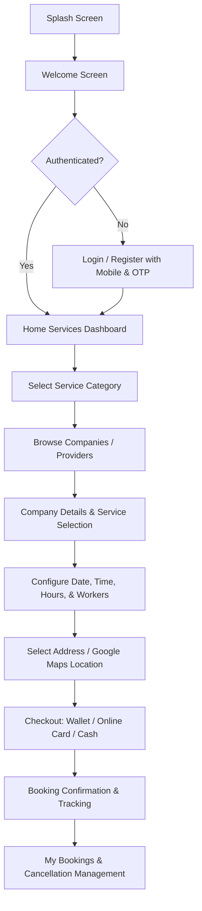

# 🌟 Al-Khadam (الخدم) — Multi-Service Platform Application

[](https://flutter.dev)
[](https://dart.dev)
[](https://developer.android.com)
[](https://developer.apple.com/ios/)
[](https://firebase.google.com/)

**Al-Khadam (الخدم)** is a cross-platform mobile application built with **Flutter** that seamlessly connects clients with premier certified service providers, domestic manpower suppliers, cleaning agencies, pest control specialists, and home nursing services across Qatar and the GCC region.

---

## 📑 Table of Contents
1. [📖 Project Overview](#-project-overview)
2. [👥 Full User Documentation](#-full-user-documentation)
   - [User Flows & Key Features](#user-flows--key-features)
   - [Localization & Accessibility](#localization--accessibility)
   - [Booking & Order Management](#booking--order-management)
3. [🛠️ Full Technical Documentation](#-full-technical-documentation)
   - [Tech Stack & Dependencies](#tech-stack--dependencies)
   - [Architecture & State Management](#architecture--state-management)
   - [Network Layer & Performance](#network-layer--performance)
   - [Security Hardening](#security-hardening)
   - [Directory Structure](#directory-structure)
   - [API Reference](#api-reference)
4. [💻 Laptop & Mac Setup & Installation Guide](#-laptop--mac-setup--installation-guide)
   - [Prerequisites](#1-prerequisites)
   - [macOS Installation (MacBook / Mac Mini / iMac)](#2-macos-installation-macbook--mac-mini--imac)
   - [Windows / Linux Laptop Installation](#3-windows--linux-laptop-installation)
   - [Environment & Configuration Setup](#4-environment--configuration-setup)
   - [Running the App](#5-running-the-app)
   - [Building for Production](#6-building-for-production)
5. [🔧 Troubleshooting & Common Issues](#-troubleshooting--common-issues)
6. [🤝 Contribution & Support](#-contribution--support)

---

## 📖 Project Overview

Al-Khadam serves as a single digital ecosystem for domestic and business services. Customers can explore service sectors, compare verified company profiles, view detailed service offerings, select custom dates, hours, and worker numbers, pick their precise address on interactive Google Maps, and checkout via wallet, card, or cash on delivery.

### 🌟 Core Service Categories:
- 🧹 **Cleaning Companies (شركات التنظيف)**: Residential, office, and deep cleaning services.
- 🧽 **Cleaning Services (خدمات التنظيف السريعة)**: Hourly and on-demand cleaning services.
- 🐜 **Anti-Bug & Pest Control (مكافحة الحشرات)**: Certified extermination and sanitization companies.
- 🩺 **Home Nursing Services (التمريض المنزلي)**: Professional home care and medical assistance.
- 👷 **Worker Suppliers & Agencies (موردي العمالة والخدم)**: Licensed domestic worker recruiters and suppliers.

---

## 👥 Full User Documentation

### User Flows & Key Features



#### 1. 🔐 Authentication & Onboarding
- **Country Code & Phone Input**: Users enter their mobile number with automatic country code detection.
- **OTP Verification**: Automated SMS verification code handling with resend timer.
- **User Registration**: Clean form capturing name, email, phone number, and location details.

#### 2. 🏠 Dynamic Home Dashboard
- Real-time service categories dynamically animated with smooth staggered transitions.
- Parallel background status checker ensuring active categories and dynamic links are always up to date.
- Quick navigation drawer with shortcuts to Profile, Saved Locations, Bookings, News, About Us, and WhatsApp direct support.

#### 3. 📅 Interactive Booking System
- **Service Configuration**: Choose specific service packages, number of staff/workers, and duration in hours.
- **Dynamic Pricing Engine**: Automated live calculation of totals, taxes, discounts, and deposit requirements.
- **Calendar & Time Slots**: Calendar date picker integration (`table_calendar`) with available real-time morning and evening booking slots.

#### 4. 📍 Precision Location & Maps
- **Interactive Google Maps**: Real-time GPS pinpointing, place dragging, and coordinate resolution.
- **Google Places Autocomplete**: Instant search for streets, zones, buildings, and landmarks in Qatar.
- **Saved Addresses**: Manage and reuse home, office, and custom delivery locations.

#### 5. 💳 Payments & Wallet
- **Multiple Payment Gateways**: Wallet balance deduction, online credit/debit card payment via secure in-app WebView, or Cash on Delivery.
- **Real-time Balance Check**: In-app wallet tracking with immediate deposit and transaction reflection.

#### 6. 🌐 Localization & Themes
- **Bilingual Support**: Instant toggle between **Arabic (العربية)** and **English**.
- **Adaptive Fonts**: Integrated `'Droid Arabic Kufi', serif` typography for optimal readability across Arabic and English scripts.
- **Theme Modes**: Full **Light Theme** and **Dark Theme** support with persistent local storage.

---

## 🛠️ Full Technical Documentation

### Tech Stack & Dependencies

| Category | Technology / Package | Purpose |
| :--- | :--- | :--- |
| **Framework** | **Flutter 3.24+ / Dart 3.5.3+** | Cross-platform UI toolkit |
| **Architecture** | **BLoC / Cubit (`flutter_bloc: ^9.1.1`)** | Predictable state management |
| **Networking** | **Dio (`dio: ^5.9.1`)** | HTTP client with connection pooling & interceptors |
| **Maps & Location** | **`google_maps_flutter`, `geolocator`, `geocoding`** | Google Maps rendering & GPS coordinates |
| **Local Storage** | **`shared_preferences: ^2.5.4`** | Persistent tokens, locale, and theme preferences |
| **UI & Layout** | **`flutter_screenutil`, `flutter_animate`** | Scalable responsive layouts & fluid animations |
| **Push Notifications** | **`firebase_messaging`, `flutter_local_notifications`** | Background/Foreground push notifications |
| **Localization** | **`easy_localization: ^3.0.8`** | JSON-based translation catalogs (`assets/lang`) |
| **Web Integration** | **`flutter_inappwebview: ^6.1.5`** | Sandboxed payment & web portal rendering |

---

### Architecture & State Management

The application adheres to a modular, feature-first Clean Architecture pattern:

```
lib/
├── core/                     # Shared foundation & infrastructure
│   ├── config/               # Colors, themes, and global typography
│   ├── data/datasources/     # ApiService, Local storage, and remote sources
│   ├── notifications/        # Firebase FCM & Push Notification helpers
│   ├── presentation/cubit/   # Global cubits (Theme, Localization, Notification)
│   ├── services/             # Core service implementations (Auth, Booking, Companies)
│   └── utils/                # API constants, validators, routes, responsive helpers
│
└── features/                 # Modular feature layers
    ├── auth/                 # Login, Register, OTP verification
    ├── bookings/             # Active bookings, history, cancellations
    ├── companies/            # Listings, Company details, Booking sheets, Payments
    ├── drawer/               # Navigation drawer items & routing
    ├── home/                 # Dynamic category home dashboard
    ├── locations/            # Saved addresses & Google Maps picker
    ├── profile_screen/       # User profile details & editing
    ├── splash/               # Animated splash startup
    ├── webview/              # Sandboxed secure in-app browser container
    └── welcome/              # Onboarding introduction carousel
```

---

### Network Layer & Performance

1. **Singleton `ApiService` with Connection Pooling**:
   - Configured with `IOHttpClientAdapter` reusing keep-alive TCP sockets (30-second idle timeout).
   - Reduces TLS handshake latency across recurring requests.
2. **Parallelized API Execution (`Future.wait`)**:
   - Category validation and home data fetching execute in parallel rather than serial queues, reducing home screen load times by **up to 7x**.
3. **Automated Interceptors**:
   - Seamless injection of `Authorization: Bearer <token>` and `x-locale: <lang>` headers.
   - Automatic retry logic for transient timeout and connection loss errors.

---

### Security Hardening

- **Strict HTTPS Enforcement**: Android `network_security_config.xml` configured with `cleartextTrafficPermitted="false"` and restricted to system CAs.
- **WebView Sandboxing**: Disabled `allowUniversalAccessFromFileURLs` and `allowFileAccess`, with origin whitelisting (`alkhadam.net`, `alkhadam.com`, `dohamaid.com`) for device permission requests.
- **R8 / ProGuard Minification**: Fully enabled code shrinking, obfuscation, and optimization in release builds.
- **Google Play Compliant Media Permissions**: Zero declared broad photo/video storage permissions; uses Android's native system Photo Picker.

---

### API Reference Summary

Base URL: `https://api.alkhadam.net/`

| Endpoint | Method | Description |
| :--- | :--- | :--- |
| `login` | `POST` | User authentication via mobile |
| `register` | `POST` | New user account creation |
| `otp` | `POST` | Verify SMS OTP code |
| `otp/resend` | `POST` | Resend verification SMS |
| `user` | `POST` | Fetch user profile data |
| `settings` | `GET` | Fetch dynamic home service categories |
| `sections/status` | `POST` | Check active status of specific service section |
| `companies/{id}` | `GET` | List companies by category ID (1=Workers, 2=Cleaning, 3=AntiBug, 4=Nursing, 8=Suppliers) |
| `company/{id}` | `GET` | Fetch specific company profile and services |
| `booking/services` | `GET` | Get available booking sub-services |
| `booking/pricing` | `POST` | Calculate estimated booking price |
| `booking/new` | `POST` | Submit new booking order |
| `booking/list` | `GET` | Get history of user bookings |
| `booking/cancel` | `POST` | Request cancellation of a booking |
| `locations` | `GET` | Retrieve user saved addresses |

---

## 💻 Laptop & Mac Setup & Installation Guide

Follow these step-by-step instructions to set up, run, and develop **Al-Khadam** on any **Mac** (Apple Silicon M1/M2/M3/M4 or Intel) or **Windows / Linux** laptop.

---

### 1. Prerequisites

Before installing the project, verify that your machine has the following tools installed:

1. **Git**: [Download Git](https://git-scm.com/downloads)
2. **Flutter SDK (Version 3.24.0 or higher)**: [Install Flutter](https://docs.flutter.dev/get-started/install)
3. **Android Studio**: [Download Android Studio](https://developer.android.com/studio)
   - Install **Android SDK Platform 35** and **Android SDK Build-Tools 35.0.0**.
   - Install **Android Command-line Tools** and **Android Emulator**.
4. **Xcode (macOS only)**: Install from Mac App Store for iOS simulator & iOS builds.
5. **VS Code** (Optional, Recommended): With Flutter and Dart extensions.

---

### 2. macOS Installation (MacBook / Mac Mini / iMac)

#### Step 2.1: Install Homebrew and Dependencies (If not already installed)
Open **Terminal** on your Mac and run:
```bash
# 1. Install Homebrew (if needed)
/bin/bash -c "$(curl -fsSL https://raw.githubusercontent.com/Homebrew/install/HEAD/install.sh)"

# 2. Install CocoaPods (essential for iOS dependencies)
brew install cocoapods

# 3. Verify CocoaPods installation
pod --version
```

#### Step 2.2: Clone the Repository
```bash
# Navigate to your desired workspace folder
cd ~/Projects

# Clone the repository
git clone https://github.com/AhmedElbasha97/alkhadam.git

# Enter the project directory
cd alkhadam/alkhadam
```

#### Step 2.3: Verify Flutter Environment
```bash
flutter doctor
```
> Ensure that both **Android toolchain** and **Xcode** show green checkmarks. If Xcode asks for licensing agreements, run `sudo xcodebuild -license accept`.

#### Step 2.4: Install Flutter & iOS Pod Dependencies
```bash
# Fetch Dart/Flutter packages
flutter pub get

# Install iOS CocoaPods
cd ios
pod install --repo-update
cd ..
```

---

### 3. Windows / Linux Laptop Installation

#### Step 3.1: Clone the Repository
Open **PowerShell** (Windows) or **Terminal** (Linux):
```powershell
# Navigate to your workspace directory
cd C:\Users\<YourUsername>\Desktop\Projects

# Clone repository
git clone https://github.com/AhmedElbasha97/alkhadam.git

# Navigate into project directory
cd alkhadam\alkhadam
```

#### Step 3.2: Verify Flutter Environment
```powershell
flutter doctor
```
> If Android licenses are pending, run: `flutter doctor --android-licenses` and accept all prompts (`y`).

#### Step 3.3: Install Flutter Dependencies
```powershell
flutter pub get
```

---

### 4. Environment & Configuration Setup

#### Google Maps API Configuration:
1. **Android**: Verify your Google Maps API key in [`android/app/src/main/AndroidManifest.xml`](file:///android/app/src/main/AndroidManifest.xml):
   ```xml
   <meta-data
       android:name="com.google.android.geo.API_KEY"
       android:value="YOUR_GOOGLE_MAPS_API_KEY_HERE" />
   ```
2. **Dart Code**: Ensure the API key in [`lib/core/utils/app_constants.dart`](file:///lib/core/utils/app_constants.dart) matches your Google Cloud project key for Autocomplete:
   ```dart
   static const String kGoogleMapsApiKey = 'YOUR_GOOGLE_MAPS_API_KEY_HERE';
   ```

#### Android Release Signing (Optional for Local Debugging, Required for Release):
Create `android/key.properties` with your upload key credentials:
```properties
storePassword=your_keystore_password
keyPassword=your_key_password
keyAlias=your_key_alias
storeFile=your_keystore_file_path.jks
```

---

### 5. Running the App

#### List Connected Devices / Simulators:
```bash
flutter devices
```

#### Launch on Android Emulator or Physical Device:
```bash
# Run in debug mode
flutter run

# Run on a specific device
flutter run -d <device_id>
```

#### Launch on iOS Simulator (macOS Only):
```bash
# Open iOS Simulator
open -a Simulator

# Run app on iOS simulator
flutter run -d iPhone
```

---

### 6. Building for Production

#### Build Android APK:
```bash
flutter build apk --release
```
> Output file: `build/app/outputs/flutter-apk/app-release.apk`

#### Build Android App Bundle (AAB for Google Play Store):
```bash
flutter build appbundle --release
```
> Output file: `build/app/outputs/bundle/release/app-release.aab`

#### Build iOS App (macOS Only):
```bash
flutter build ipa --release
```
> Output folder: `build/ios/archive/Runner.xcarchive` (Open in Xcode Organizer for App Store upload).

---

## 🔧 Troubleshooting & Common Issues

| Issue | Cause | Solution |
| :--- | :--- | :--- |
| **`CocoaPods' output: pod install failed`** | Outdated CocoaPods cache or missing gem | Run: `cd ios && pod deintegrate && pod repo update && pod install && cd ..` |
| **`Gradle build failed with Java heap space`** | Gradle JVM memory constraint | Ensure `android/gradle.properties` contains `org.gradle.jvmargs=-Xmx4096m` |
| **`Google Maps shows blank / grey screen`** | Missing or unrestricted API key | Enable **Maps SDK for Android** and **Maps SDK for iOS** in Google Cloud Console |
| **`Location permission not prompted`** | System permission settings | Open device/emulator settings $\rightarrow$ Apps $\rightarrow$ Al-Khadam $\rightarrow$ Permissions $\rightarrow$ Enable Location |
| **`MissingPluginException`** | Native plugins not rebuilt | Stop the running app, run `flutter clean`, `flutter pub get`, and re-run `flutter run` |

---

## 🤝 Contribution & Support

- **Repository**: [AhmedElbasha97/alkhadam](https://github.com/AhmedElbasha97/alkhadam)
- **Lead Developer**: Ahmed Elbasha
- **Platform**: Al-Khadam Qatar / GCC

For support, feature requests, or technical inquiries, please open an issue in the repository or contact the project engineering team.
